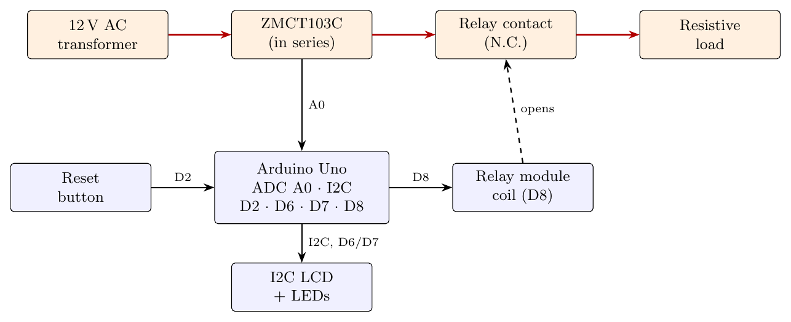

# Microcontroller-Based Overcurrent Relay: IEC Very Inverse

## 🚀 Overview
A **digital overcurrent relay** built on an Arduino Uno that follows the **IEC Very Inverse** time-current characteristic. It measures the AC load current, estimates its RMS value, calculates the required trip time from the pickup current (Is) and the Time Multiplier Setting (TMS), and opens a relay output when the fault lasts long enough.

> This is an **educational bench prototype** (12 V AC / 1 A test bench), not a certified protection device.

## ⚙️ How It Works

### 1. Current measurement and RMS estimation
* The **ZMCT103C** current transformer output is DC-biased (2.5 V offset) so the Arduino's 0–5 V ADC can read the bipolar AC signal on **A0**.
* The code samples over an AC cycle, takes the maximum and minimum, and estimates the RMS value with the **peak-to-peak method**: `RMS = (max − min) / 2.828`, then converts it to amperes with a calibration factor. This is a good estimate for **sinusoidal** waveforms only.

### 2. IEC Very Inverse trip logic
When `I ≥ Is` the trip time is calculated from the standard equation:

`t = 13.5 × TMS / ((I / Is) − 1)`   (α = 1, β = 13.5)

An **active timer** accumulates the fault duration. If the current falls below `Is` before the timer reaches `t`, the timer resets, so short transients such as motor-starting inrush do not cause a trip.

### 3. Indication and reset
* **I2C 16×2 LCD** (address `0x27`): measured current, calculated trip time and status (Normal / Trip).
* **Green LED** = normal, **red LED** = tripped.
* **Reset button** restores the normal state after the fault is cleared.

## 🔧 Default Settings
| Parameter | Value |
| :--- | :--- |
| Pickup current `Is` | 0.4 A |
| Time multiplier `TMS` | 0.05 |
| Curve constants | α = 1, β = 13.5 (IEC Very Inverse) |
| Test bench | 12 V AC / 1 A step-down transformer with wire-wound resistors as load |

**Theoretical trip times with the default settings** (calculated from the formula):

| Load current | I / Is | Trip time |
| :---: | :---: | :---: |
| 0.6 A | 1.5 | 1.35 s |
| 0.8 A | 2.0 | 0.675 s |
| 1.0 A | 2.5 | 0.45 s |

## 🔌 Hardware & Pin Map
| Item | Connection |
| :--- | :--- |
| Arduino Uno | Main controller |
| ZMCT103C current transformer | Analog input **A0** |
| 1-channel 5 V relay module | Digital output **D8** (driven LOW on trip, HIGH in normal state) |
| Green LED / Red LED | **D7** / **D6** |
| Reset push button | **D2** (`INPUT_PULLUP`) |
| 16×2 I2C LCD | I2C, address `0x27` |

## 📂 Repository Structure
* `Code/Protection_Proj.ino` — Arduino source code.
* `Docs/overcurrent-relay-very-inverse.pdf` — project report (theory, hardware setup, time-current performance).
* `Docs/LaTeX_Source/` — LaTeX source of the report (the block diagram, flowchart and time-current curve are drawn inside the `.tex`) and `Images/` (component photos, `block_diagram.png`, logo).

## ▶️ How to Run
1. Install the **LiquidCrystal_I2C** library in the Arduino IDE.
2. Open `Code/Protection_Proj.ino`, wire the circuit as in the pin map, and upload to the Arduino Uno.
3. Adjust `Is` and `TMS` at the top of the sketch if you use a different test bench.

## 👨‍💻 Author
**Abd El-Rhman Muhammad Saad** — Electrical Power and Machines Engineering, Alexandria University.
[LinkedIn](https://linkedin.com/in/Abd-El-Rhman-Saad) · [GitHub](https://github.com/Abd-El-Rhman-Saad)
