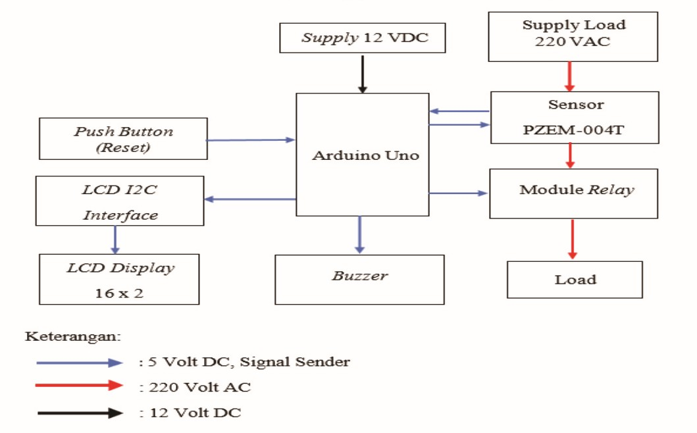

# Microcontroller-Based Overcurrent Relay: Very Inverse Time Characteristic

## 🚀 Overview
This repository contains the design, software logic, and hardware implementation of a **Digital Overcurrent Relay** based on an Arduino Uno microcontroller. The system accurately mimics the **IEC Very Inverse** time-current characteristic, providing robust and dynamic power system protection.

The relay continuously monitors AC load current, calculates the True RMS value, and autonomously executes trip logic based on user-defined Pickup Current ($I_s$) and Time Multiplier Settings (TMS), ensuring precise fault isolation while avoiding nuisance tripping during temporary transients.

## ⚙️ Core Features & Methodology

### 1. True RMS Signal Processing
*   The bipolar AC signal from the ZMCT103C current transformer is DC-biased (2.5V offset) to be safely read by the Arduino's 0-5V ADC.
*   The software calculates the **True RMS** current by isolating the DC offset, squaring discrete samples, and computing the mean over a full 50 Hz AC cycle (20 ms), guaranteeing high immunity to noise and harmonics.

### 2. IEC Very Inverse Algorithm
*   Upon detecting a fault ($I \ge I_s$), the required tripping time is calculated dynamically using the standardized IEC equation:
    `t = (13.5 / ((I / Is) - 1)) * TMS`
*   **Transient Fault Handling:** An active execution timer monitors the fault duration. If the current drops below the pickup value ($I_s$) before the timer reaches $t_{trip}$, the timer resets, effectively preventing nuisance trips caused by motor starting inrush currents.

### 3. Human-Machine Interface (HMI)
*   An **I2C 16x2 LCD** provides real-time monitoring of the RMS current, calculated trip time, and operational status.
*   Integrated **Push Buttons** allow for dynamic, on-the-fly adjustment of the $I_s$ and $TMS$ parameters.
*   A **Buzzer** provides immediate audible annunciation upon a fault trip.

## 🛠️ Hardware Components
*   **Microcontroller:** Arduino Uno
*   **Current Sensors:** ZMCT103C Micro Precision CT / PZEM-004T
*   **Isolation:** 1-Channel 5V Relay Module
*   **HMI:** 16x2 I2C LCD Display, Push Buttons, Active Buzzer
*   **Load Simulation:** High-power wire-wound resistors & Step-down Transformer

## 📂 Repository Structure
*   `Code/`: Contains the Arduino source code (`Protection_Proj.ino`).
*   `Docs/`: Contains the comprehensive project report (`microcontroller-overcurrent-relay.pdf`) detailing the theoretical background, hardware setup, and Time-Current performance characteristics.
*   `Docs/LaTeX_Source/`: Contains the LaTeX source code and the `Images/` subfolder with all hardware photos, flowcharts, and curve plots.

## 👨‍💻 Author
**Abd El-Rahman Muhammad Saad Muhammad**
*   **University:** Alexandria University
*   **Department:** Electrical Engineering
